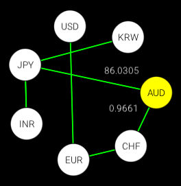

# Graphiz [](https://jitpack.io/#Ptit-Biscuit/graphiz)
Graph manipulation and visualization using kotlin and openrndr.

## Features
[x] Create a generic graph
[x] Optional weights on edges
[x] Basic order, size, degree of graph
[x] Directed or undirected graph
[x] Vertex degree, adjacency, children
[x] Shortest path between two vertices

## Visualisation
You can visualise graphs with the provided openrndr extension.

``` kotlin
application {
    program {
        val fontUrl = "src/main/resources/Roboto-Light.ttf"
        extend(Graphiz(graph, fontUrl))
    }
}
```

